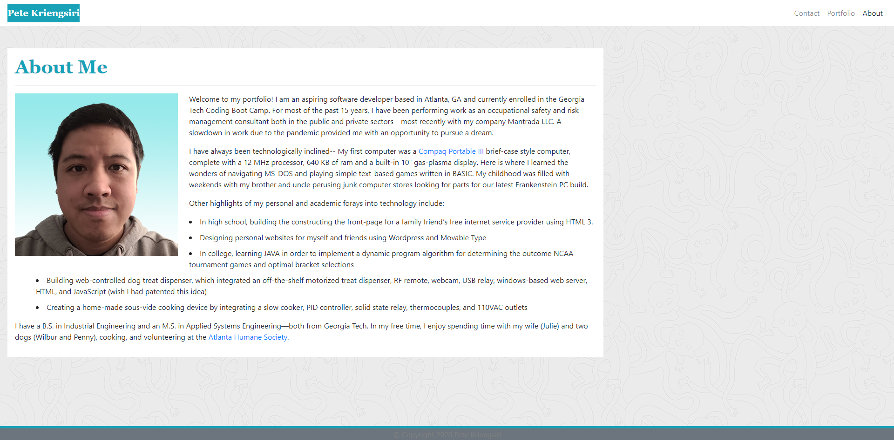

# portfolio
Portfolio for Pete Kriengsiri

## Description

This application is a single-page weather dashboard.  It was created using HTML, CSS, Bootstrap CSS Framework, JavaScript, jQuery, and the font-awesome icon pack.  The application uses jQuery AJAX calls to the Open Weather API to obtain weather and UV information.  This dashboard allows the user to input a desired city, and will present the user with current weather conditions as well as a five day forecast.

### Features
* Current weather conditions and five day forecast for a user selected city 
* UV index, with color coding based upon the severity of the exposure as defined by the US EPA
* User searches are saved in localStorage for up to the last 10 cities searched
* When the user reopens the application, it will display the last city searched in addition to a listing of previous cities searched
* Clicking on a previous search button will redisplay the current weather and forecast for that city
* The application will provide a warning to the user if the city entered into the search field does not match a city in the Open Weather API database

## Installation
Upload index.html, LICENSE, and assets folder to the deployed webserver.  Assets folder contains JavaScript, CSS files, and images.

The application shown below was deployed using GitHub Pages.  The repository can be replicated by via fork, clone, and redeployment with GitHub Pages.

Link to repository: https://github.com/pkriengsiri/weather-dashboard

## Usage
Upon accessing the application for the first time, the user will only be presented with a search field where they can enter their desired city.  After the first search, current weather, 5 day forecast, and a listing of previous searches will appear.  Previous cities searched will be stored in localStorage and will be recalled the next time the user accesses the application. 

Link to deployed instance of the application: https://pkriengsiri.github.io/weather-dashboard/

## Credits
Collaborators on this project included instructional staff, TAs, and students in the Georgia Tech Coding Boot Camp Winter 2020 cohort.   Stock pictures from ![Aaron Burden]

### Referenced Utilized
* https://openweathermap.org/api
* https://developer.mozilla.org/en-US/docs/Web/JavaScript/Reference/Global_Objects/Date
* https://api.jquery.com/deferred.then/

## License

MIT License

Copyright (c) 2020 Pete Kriengsiri

Permission is hereby granted, free of charge, to any person obtaining a copy
of this software and associated documentation files (the "Software"), to deal
in the Software without restriction, including without limitation the rights
to use, copy, modify, merge, publish, distribute, sublicense, and/or sell
copies of the Software, and to permit persons to whom the Software is
furnished to do so, subject to the following conditions:

The above copyright notice and this permission notice shall be included in all
copies or substantial portions of the Software.

THE SOFTWARE IS PROVIDED "AS IS", WITHOUT WARRANTY OF ANY KIND, EXPRESS OR
IMPLIED, INCLUDING BUT NOT LIMITED TO THE WARRANTIES OF MERCHANTABILITY,
FITNESS FOR A PARTICULAR PURPOSE AND NONINFRINGEMENT. IN NO EVENT SHALL THE
AUTHORS OR COPYRIGHT HOLDERS BE LIABLE FOR ANY CLAIM, DAMAGES OR OTHER
LIABILITY, WHETHER IN AN ACTION OF CONTRACT, TORT OR OTHERWISE, ARISING FROM,
OUT OF OR IN CONNECTION WITH THE SOFTWARE OR THE USE OR OTHER DEALINGS IN THE
SOFTWARE.

## Badges

## Contributing

This project is not accepting contributions at this time.

 

Photo by <a href="https://unsplash.com/@aaronburden?utm_source=unsplash&amp;utm_medium=referral&amp;utm_content=creditCopyText">Aaron Burden</a> on <a href="https://unsplash.com/s/photos/contact?utm_source=unsplash&amp;utm_medium=referral&amp;utm_content=creditCopyText">Unsplash</a>
Photo by <a href="https://unsplash.com/@cdr6934?utm_source=unsplash&amp;utm_medium=referral&amp;utm_content=creditCopyText">Chris Ried</a> on <a href="https://unsplash.com/s/photos/circuit-board?utm_source=unsplash&amp;utm_medium=referral&amp;utm_content=creditCopyText">Unsplash</a>
Photo by <a href="https://unsplash.com/@benjamiindutton?utm_source=unsplash&amp;utm_medium=referral&amp;utm_content=creditCopyText">Ben Dutton</a> on <a href="https://unsplash.com/@benjamiindutton?utm_source=unsplash&amp;utm_medium=referral&amp;utm_content=creditCopyText">Unsplash</a>