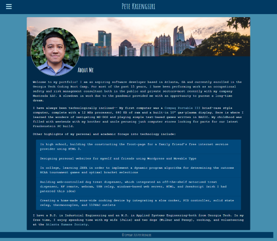
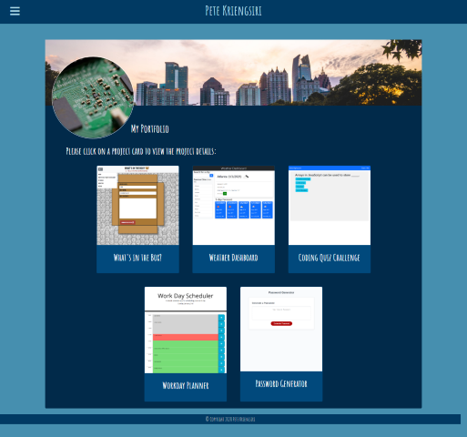
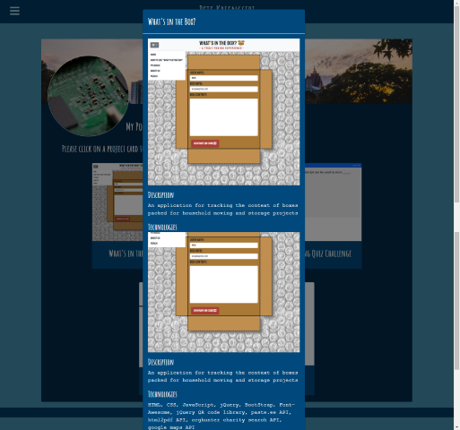
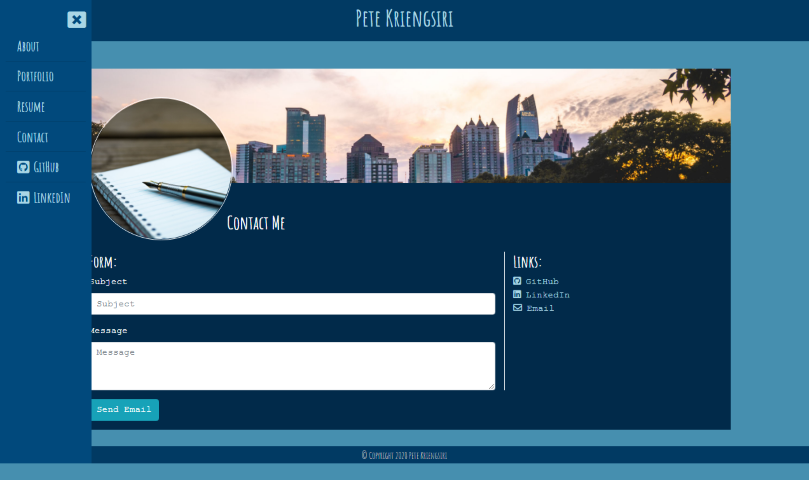

# portfolio
Portfolio for Pete Kriengsiri

## Description

This application is three page personal portfolio.  It was created using HTML, CSS, Bootstrap CSS Framework, JavaScript, jQuery, and the font-awesome icon pack.  

### Features
* Three sections including about me, portfolio, and contact
* Collapsible sidebar featuring the sites navigation links as well as links to external resources
* Cards and modal windows for displaying portfolio projects
* Contact form which auto populates an email to the site author
* Responsive layout suitable for mobile and desktop browsers

## Installation
Upload index.html, contact.html, portfolio.html, LICENSE, and assets folder to the deployed webserver.  The assets folder contains JavaScript, CSS files, and images.

The application shown below was deployed using GitHub Pages.  The repository can be replicated by via fork, clone, and redeployment with GitHub Pages.

Link to repository: https://github.com/pkriengsiri/portfolio 

## Usage
The user can access the sidebar by clicking on the hamburger menu icon in the top left corner of the application.  The sidebar contains links to the other sections of the application.  

Link to deployed instance of the application: https://pkriengsiri.github.io/portfolio/

## Credits
Thanks to my wife, Julie, who took the picture of me.

Stock pictures from [Aaron Burden](https://unsplash.com/@aaronburden?utm_source=unsplash&amp;utm_medium=referral&amp;utm_content=creditCopyText), [Chris Ried](https://unsplash.com/@cdr6934?utm_source=unsplash&amp;utm_medium=referral&amp;utm_content=creditCopyText), and [Ben Dutton](https://unsplash.com/@benjamiindutton?utm_source=unsplash&amp;utm_medium=referral&amp;utm_content=creditCopyText) on [Unsplash](https://unsplash.com/).

Color palette from [coolers.co](https://coolors.co/012a4a-013a63-01497c-014f86-2a6f97-2c7da0-468faf-61a5c2-89c2d9-a9d6e5). 

### References Utilized
* https://www.w3schools.com/howto/howto_js_collapse_sidebar.asp
* https://getbootstrap.com/docs/4.0/components/modal/ 

## License

MIT License

Copyright (c) 2020 Pete Kriengsiri

Permission is hereby granted, free of charge, to any person obtaining a copy
of this software and associated documentation files (the "Software"), to deal
in the Software without restriction, including without limitation the rights
to use, copy, modify, merge, publish, distribute, sublicense, and/or sell
copies of the Software, and to permit persons to whom the Software is
furnished to do so, subject to the following conditions:

The above copyright notice and this permission notice shall be included in all
copies or substantial portions of the Software.

THE SOFTWARE IS PROVIDED "AS IS", WITHOUT WARRANTY OF ANY KIND, EXPRESS OR
IMPLIED, INCLUDING BUT NOT LIMITED TO THE WARRANTIES OF MERCHANTABILITY,
FITNESS FOR A PARTICULAR PURPOSE AND NONINFRINGEMENT. IN NO EVENT SHALL THE
AUTHORS OR COPYRIGHT HOLDERS BE LIABLE FOR ANY CLAIM, DAMAGES OR OTHER
LIABILITY, WHETHER IN AN ACTION OF CONTRACT, TORT OR OTHERWISE, ARISING FROM,
OUT OF OR IN CONNECTION WITH THE SOFTWARE OR THE USE OR OTHER DEALINGS IN THE
SOFTWARE.

## Badges

## Contributing

This project is not accepting contributions at this time.